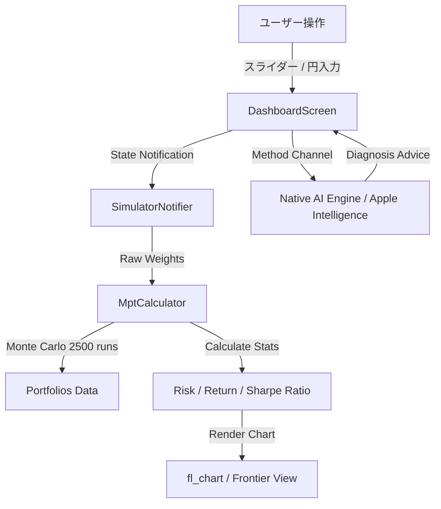

# 現代ポートフォリオ理論シミュレーター (Modern Portfolio Theory Simulator)


**現代ポートフォリオ理論 (MPT)** に基づき、直感的なUIで資産配分（アセットアロケーション）の最適化やリスク・リターンの可視化を行えるインタラクティブなシミュレーションアプリです。

---

## 🌟 主な機能

### 1. 🎛️ 直感的なアロケーション調整
- **独立スライダーモード (`%`)**: 1つの資産比率を変えても他のパラメータが勝手に連動しない独立操作設計。
- **手入力モード (`円 ¥`)**: SBI証券などの保有金額（円）を直接入力するだけで、アセットアロケーション比率を自動算出。
- **直接%入力**: 比率数値をタップしてテンキーから%をダイレクト入力可能。
- **合計進捗ゲージ**: 現在のトータル配分率（100%過不足時のアラート表示機能つき）を可視化。

### 2. 📈 効率的フロンティア・シミュレーション
- 2,500パターン以上のモンテカルロ・シミュレーションを瞬時に実行。
- リスクに対するリターンを最大化する**シャープ比最高ポートフォリオ (Max Sharpe)** と **最小分散ポートフォリオ (Min Variance)** を自動特定。

### 3. 📉 ストレステスト（ショックシミュレーション）
- リーマンショック、コロナショック、円高進行などの過去の暴落シナリオを想定。
- 設定したポートフォリオがどの程度の最大ドローダウン（資産減少）を被るかを瞬時に算出。

### 4. 💱 外貨リスク可視化
- 為替リスクを伴う資産（米国株・海外REIT等）には「💱 外貨」バッジを自動付与。
- 為替変動リスクを直感的に把握可能。

### 5. 🤖 オンデバイス AI 診断 (Apple Intelligence / Fallback)
- 設定したアロケーションに対するリスク・リターン評価やアドバイスを自動生成。
- iOS端末のオンデバイスLLM（Apple Intelligence）を活用し、オフライン/プライバシー保護環境で診断を実行（※未対応環境ではフォールバックロジックで高速レスポンス）。

---

## 📊 システムアーキテクチャ



---

## 🛠️ 技術スタック

| カテゴリ | 使用技術 |
|---|---|
| **フレームワーク** | Flutter 3.x (Dart) |
| **状態管理** | Flutter Riverpod (`StateNotifierProvider`) |
| **グラフ・可視化** | `fl_chart` (Efficient Frontier & Pie Charts) |
| **デザインシステム** | Custom Dark Glassmorphism Design System |
| **AI / ネイティブ連携** | iOS Native Swift MethodChannel (Apple Intelligence Integration) |

---

## 🚀 開発環境のセットアップ

### 前提条件
- Flutter SDK (3.x 以上)
- Xcode 15+ (iOSシミュレーター / 実機実行用)

### クローン & 実行手順

```bash
# 1. リポジトリのクローン
git clone https://github.com/Shun-Prog/modern-portfolio-theory-simulator.git
cd modern-portfolio-theory-simulator

# 2. パッケージの取得
flutter pub get

# 3. アプリの起動 (iOSシミュレーター)
flutter run
```

---

## 📄 ライセンス

本プロジェクトは [MIT License](LICENSE) のもとで公開されています。